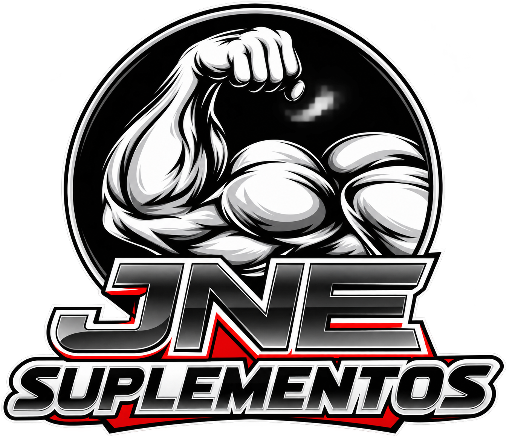

# Documentação da JNE Suplementos

<p align="center">
  
</p>

Este repositório contém o cofre Obsidian e o site Quartz usado para documentar o catálogo da JNE Suplementos.

## Links

- [Documentação publicada](https://fernando-roque-original.github.io/jne-suplementos-docs/)
- [Código do site](https://github.com/andrad21/jne-suplementos)
- [Repositório desta documentação](https://github.com/Fernando-Roque-Original/jne-suplementos-docs)

## Conteúdo

A pasta `content/` é o cofre compartilhado. Ela reúne:

- visão geral do projeto;
- manutenção de produtos, imagens, preços e estoque;
- galeria de frente e rótulo e tratamento reproduzível das fotos da loja;
- cadastro de perfis nutricionais;
- funcionamento do carrinho e do WhatsApp;
- publicação no GitHub Pages;
- curso básico do código Next.js;
- decisões de design da landing page, animações e acessibilidade;
- planejamento do painel de produtos e de uma futura operação de e-commerce;
- identidade visual, favicon e imagens de compartilhamento.

## Editar no Obsidian

Abra a pasta principal deste repositório como cofre. Os links internos usam o formato do Obsidian e os caminhos são relativos, por isso funcionam em qualquer computador.

## Executar o Quartz

```bash
npm ci
npx quartz build --serve
```

Acesse `http://localhost:8080`.

## Validar

```bash
npx prettier --check "content/**/*.md" README.md
npx quartz build
```

O procedimento completo de atualização está em `content/04 - Publicação/02 - Atualização do Quartz.md`.
