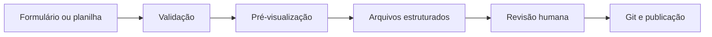

# Cadastro rápido e perfis nutricionais

O cadastro foi reorganizado para diminuir a repetição. Agora existem três responsabilidades separadas:

| Parte            | Arquivo                                    | Responsabilidade                                  |
| ---------------- | ------------------------------------------ | ------------------------------------------------- |
| Dados comerciais | `src/data/produtos.ts`                     | nome, preço, imagem, estoque, categoria e sabores |
| Dados do rótulo  | `src/data/perfis-nutricionais.ts`          | porção, nutrientes, ingredientes e observações    |
| Apresentação     | `src/components/InformacaoNutricional.tsx` | transforma qualquer perfil em tabela responsiva   |

> [!important]
> Use um perfil geral somente quando todos os sabores tiverem o mesmo rótulo. Quando valores, ingredientes ou alertas mudarem, associe `imagem` e `infoNutricional` à variação correspondente.

## O que melhorou

- não é mais necessário escrever HTML para cada rótulo;
- tabelas simples e tabelas com várias doses usam o mesmo formato;
- um produto pode ter uma tabela nutricional e outra de aminoácidos ou ativos;
- ingredientes e observações são campos opcionais;
- a página troca foto e rótulo quando o sabor é selecionado;
- o build detecta linhas com quantidade incorreta de valores;
- tabelas extensas recebem rolagem interna no celular;
- URLs antigas dos produtos continuam redirecionando para o cadastro atual.

## Exemplo de perfil

```ts
export const perfilExemplo: InformacaoNutricional = {
  porcao: "30 g (1 dosador)",
  porcoesPorEmbalagem: "30",
  tabelas: [
    {
      titulo: "Informação Nutricional",
      colunas: ["Quantidade por porção", "%VD"],
      linhas: [
        { nome: "Proteínas", valores: ["20 g", "40%"] },
        { nome: "Carboidratos", valores: ["4 g", "1%"] },
      ],
    },
  ],
  ingredientes: "Texto conferido no rótulo.",
  observacoes: ["Não contém glúten."],
}
```

Cada linha precisa ter um valor para cada coluna. Se a tabela tem duas colunas, `valores` também precisa ter dois itens.

> [!warning] Dados do rótulo
> Não calcule, arredonde ou complete valores ausentes. Não invente `%VD`. Mantenha a unidade exatamente como foi conferida no rótulo.

## Regra obrigatória para sabores

Sabor não é apenas uma opção visual. A troca de aromatizante, fruta, cacau ou outro ingrediente pode alterar calorias, carboidratos, açúcares, sódio, alergênicos e a própria lista de ingredientes.

> [!important] Conferência individual
> Nunca copie a tabela de um sabor para outro por semelhança de nome ou embalagem. Um perfil só pode ser compartilhado quando o fabricante publicar a mesma tabela e a mesma fórmula-base para todas as variações. Sem essa confirmação, deixe a tabela pendente.

Para cada sabor:

1. confira nome, peso e versão da embalagem;
2. use a foto do rótulo correspondente ao sabor;
3. transcreva porção, quantidade de porções, calorias e todos os nutrientes;
4. transcreva ingredientes, alergênicos, lactose e glúten;
5. compare o resultado com os demais sabores;
6. crie um perfil próprio quando qualquer informação mudar;
7. registre a fonte e a data da conferência em [[03 - Fontes e pendências do catálogo]].

Se houver uma nova embalagem ou novo lote, repita a conferência. O rótulo físico prevalece sobre chamadas publicitárias e textos resumidos da página comercial.

## Fluxo atual para adicionar um produto

1. Coloque a fotografia em `src/assets/produtos/`.
2. Importe a imagem em `src/data/produtos.ts`.
3. Cadastre os dados comerciais e os sabores.
4. Crie o perfil em `src/data/perfis-nutricionais.ts`.
5. Ligue o produto ao perfil geral com `infoNutricional` somente se a igualdade entre sabores estiver confirmada.
6. Quando o rótulo mudar ou ainda não estiver confirmado, ligue cada variação à sua imagem e ao seu próprio perfil.
7. Execute `npm run check` e `npm run build`.
8. Confira a página em desktop e celular.

Exemplo de variação com foto e rótulo próprios:

```ts
{
  id: "chocolate",
  nome: "Chocolate",
  imagem: imgChocolate,
  infoNutricional: perfilChocolate,
  estoque: 5,
}
```

## Como reduzir ainda mais o trabalho

Para poucos produtos, os arquivos estruturados são suficientes. Para dezenas ou centenas de produtos, o próximo passo recomendado é um gerador interno:



O gerador pode receber uma planilha com abas para produtos, sabores e nutrientes. Ele deve bloquear IDs repetidos, campos obrigatórios ausentes, números de colunas incorretos e valores sem unidade.

Essa ferramenta pode funcionar apenas no computador da equipe e gerar arquivos para revisão. Assim, não exige banco, login ou um painel público nesta fase.

Consulte [[07 - Evolução para e-commerce/03 - Painel de produtos e estoque|Painel de produtos e estoque]] para a evolução futura.
