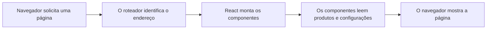

# Curso básico do código

Este capítulo foi escrito para quem nunca trabalhou com o código de um site. Ele explica os termos básicos, a função de cada pasta e como fazer alterações simples com segurança.

## Qual tecnologia este projeto usa

O site da JNE Suplementos usa:

- **React** para criar a interface em componentes;
- **TypeScript** para verificar os tipos dos dados e reduzir erros;
- **TSX** para escrever estrutura visual junto com TypeScript;
- **Next.js** para criar páginas, layouts, metadados, renderização e build;
- **Tailwind CSS** para aplicar estilos por meio de classes.

O Next.js é um framework construído sobre React. React cria os componentes; Next.js organiza páginas, execução no servidor, navegação, imagens, fontes e publicação.

## O que acontece quando alguém abre o site

De forma simplificada:



O navegador é o programa usado pelo cliente, como Chrome, Edge ou Firefox. Ele recebe HTML, CSS e JavaScript e transforma esses arquivos na página visível.

## Frontend e backend

**Frontend** é a parte que o visitante vê e usa: páginas, botões, imagens, catálogo, filtros e carrinho.

**Backend** normalmente é a parte executada em um servidor: banco de dados, login, pagamentos, estoque central e APIs.

Este projeto funciona principalmente como frontend. Os produtos ficam em um arquivo do próprio código e o carrinho fica salvo no navegador do cliente. A venda é concluída no WhatsApp. Portanto, não existe atualmente um painel administrativo ou banco de dados para cadastrar produtos.

## O que é HTML

HTML define a estrutura de uma página. Ele usa elementos, também chamados de tags.

```html
<h1>JNE Suplementos</h1>
<p>Escolha seus produtos.</p>
```

`<h1>` abre o título e `</h1>` fecha o título. O mesmo acontece com `<p>` e `</p>`.

### Tags mais comuns

| Tag         | Para que serve                          |
| ----------- | --------------------------------------- |
| `<header>`  | Cabeçalho de uma página ou seção        |
| `<footer>`  | Rodapé de uma página ou seção           |
| `<main>`    | Conteúdo principal da página            |
| `<nav>`     | Área de navegação e menus               |
| `<section>` | Agrupa uma seção relacionada            |
| `<div>`     | Agrupamento genérico para layout        |
| `<h1>`      | Título principal da página              |
| `<h2>`      | Título de uma seção                     |
| `<p>`       | Parágrafo                               |
| `<a>`       | Link                                    |
| `<button>`  | Botão de ação                           |
| ``     | Imagem                                  |
| `<input>`   | Campo de entrada                        |
| `<label>`   | Nome ou explicação de um campo          |
| `<form>`    | Conjunto de campos enviado pelo usuário |

### Header e Footer

**Header** significa cabeçalho. No site da JNE, ele contém a marca, o menu e o acesso ao carrinho. O arquivo é `src/components/Header.tsx`.

**Footer** significa rodapé. Ele fica no final do site e contém informações complementares, contato e navegação. O arquivo é `src/components/Footer.tsx`.

Os dois aparecem em todas as páginas porque são usados na estrutura principal `src/app/layout.tsx`.

## O que é CSS

CSS controla a aparência: cores, tamanho, espaçamento, bordas, alinhamento e comportamento em telas diferentes.

Neste projeto, existem duas formas principais de estilo:

1. variáveis e regras globais em `src/styles.css`;
2. classes do Tailwind escritas diretamente nos componentes.

Exemplo:

```tsx
<div className="mx-auto max-w-7xl px-4 py-8">
  <h1 className="text-4xl font-bold">Catálogo</h1>
</div>
```

Nesse exemplo:

- `mx-auto` centraliza o bloco horizontalmente;
- `max-w-7xl` limita a largura;
- `px-4` adiciona espaço nas laterais;
- `py-8` adiciona espaço em cima e embaixo;
- `text-4xl` aumenta o texto;
- `font-bold` deixa o texto em negrito.

Em React usa-se `className`, e não `class`, para definir classes CSS.

## O que é JavaScript

JavaScript adiciona comportamento à página. Ele permite reagir a cliques, filtrar produtos, calcular totais e abrir o WhatsApp.

Exemplo simples:

```ts
function somar(a: number, b: number) {
  return a + b
}
```

A palavra `function` cria uma função. Uma função é um bloco reutilizável que recebe dados, executa uma tarefa e pode devolver um resultado.

## O que é TypeScript

TypeScript é JavaScript com verificação de tipos. Ele ajuda a identificar problemas antes que o site seja publicado.

```ts
function formatarNome(nome: string): string {
  return nome.trim()
}
```

`nome: string` informa que o parâmetro precisa ser texto. O segundo `: string` informa que a função devolve texto.

No catálogo, o tipo `Produto` define quais informações um produto precisa ter. Ele está em `src/data/tipos.ts`.

## Diferença entre `.ts` e `.tsx`

Arquivos `.ts` contêm TypeScript sem estrutura visual JSX. São usados para dados, configurações e funções.

Exemplos:

- `src/data/produtos.ts`;
- `src/config/loja.ts`;
- `src/lib/whatsapp.ts`.

Arquivos `.tsx` contêm TypeScript e também elementos visuais parecidos com HTML.

Exemplos:

- `src/components/Header.tsx`;
- `src/app/PaginaInicial.tsx`;
- `src/app/carrinho/CarrinhoCliente.tsx`.

O `x` no final indica que o arquivo pode usar JSX:

```tsx
function Titulo() {
  return <h1>JNE Suplementos</h1>
}
```

## O que é JSX

JSX é a sintaxe que permite escrever elementos visuais dentro do JavaScript ou TypeScript.

```tsx
const nome = "Creatina"

return <h2>{nome}</h2>
```

As chaves `{}` permitem inserir uma variável ou expressão JavaScript no conteúdo visual.

Para exibir uma lista, usa-se frequentemente `map`:

```tsx
{
  produtos.map((produto) => <CardProduto key={produto.id} produto={produto} />)
}
```

Esse código percorre a lista `produtos` e cria um cartão para cada item.

## O que é React

React organiza a interface em componentes. Um componente é uma função que devolve a estrutura de uma parte da página.

```tsx
function Aviso() {
  return <p>Pedido enviado pelo WhatsApp.</p>
}
```

Componentes começam normalmente com letra maiúscula. Eles podem ser usados como se fossem tags:

```tsx
<Aviso />
```

### Props

Props são valores enviados de um componente para outro.

```tsx
function Titulo({ texto }: { texto: string }) {
  return <h2>{texto}</h2>
}

;<Titulo texto="Mais vendidos" />
```

No site, `CardProduto` recebe uma prop chamada `produto`.

### Estado

Estado é um valor que pode mudar enquanto a pessoa usa a página.

```tsx
const [busca, setBusca] = useState("")
```

- `busca` contém o valor atual;
- `setBusca` altera o valor;
- `""` é o valor inicial vazio;
- `useState` é um Hook do React.

A busca e os filtros do catálogo são exemplos de estado.

### Hooks

Hooks são funções do React que adicionam recursos aos componentes.

| Hook         | Uso no projeto                                         |
| ------------ | ------------------------------------------------------ |
| `useState`   | Guarda busca, filtro, quantidade e estados visuais     |
| `useMemo`    | Evita recalcular listas sem necessidade                |
| `useEffect`  | Executa uma ação após renderização ou mudança de dados |
| `useContext` | Acessa o carrinho compartilhado                        |

Hooks devem ser chamados dentro de componentes ou de outros Hooks, nunca dentro de condições comuns.

## Para que serve a pasta `src`

`src` é abreviação de **source**, que significa código-fonte. É onde fica o código que será transformado na aplicação final.

```text
src/
├── assets/       imagens
├── components/   partes reutilizáveis
├── config/       configuração da loja
├── data/         produtos, categorias e tipos
├── hooks/        comportamentos reutilizáveis do React
├── lib/          regras e funções auxiliares
├── app/          páginas e layouts do Next.js
└── styles.css    aparência global
```

### `src/assets`

Guarda arquivos visuais importados pelo código. As fotos dos produtos ficam em `src/assets/produtos/`.

### `src/components`

Guarda blocos usados em mais de um lugar. Exemplos: Header, Footer e CardProduto.

### `src/components/ui`

Guarda componentes básicos de interface, como Button, Input e Dialog. Eles são a base visual. Não é a pasta principal para editar textos da loja.

### `src/config`

Guarda dados gerais de configuração. `src/config/loja.ts` centraliza nome, telefone, WhatsApp, endereço e redes sociais.

### `src/data`

Guarda dados locais e seus formatos. Produtos e categorias ficam nessa pasta.

### `src/hooks`

Guarda Hooks reutilizáveis. Um Hook normalmente começa com `use`, como `useMobile`.

### `src/lib`

Guarda regras que não são páginas visuais. No projeto, contém carrinho, WhatsApp, formatação e tratamento de erros.

### `src/app`

Guarda as páginas e layouts. Cada rota é uma pasta com um arquivo `page.tsx`. O arquivo `layout.tsx` cria a estrutura compartilhada.

## Imports e o símbolo `@`

No começo dos arquivos aparecem linhas como:

```tsx
import { Header } from "@/components/Header"
```

`import` traz código de outro arquivo. O alias `@/` representa a pasta `src/`. Portanto:

```text
@/components/Header
```

equivale a:

```text
src/components/Header
```

Imports com chaves trazem uma exportação nomeada. Imports sem chaves normalmente trazem uma exportação padrão ou um arquivo, como uma imagem.

## Export

`export` permite que outro arquivo importe uma função, variável ou componente.

```ts
export const nomeDaLoja = "JNE Suplementos"
```

Sem `export`, esse valor só pode ser usado dentro do próprio arquivo.

## Como funcionam as páginas e rotas

Uma rota liga um endereço a uma página.

| Arquivo                                | Endereço            |
| -------------------------------------- | ------------------- |
| `src/app/page.tsx`                     | `/`                 |
| `src/app/catalogo/page.tsx`            | `/catalogo`         |
| `src/app/carrinho/page.tsx`            | `/carrinho`         |
| `src/app/sobre/page.tsx`               | `/sobre`            |
| `src/app/produto/[produtoId]/page.tsx` | `/produto/algum-id` |

O `page.tsx` colocado diretamente em `src/app` representa a página inicial. Os colchetes em `[produtoId]` indicam uma parte variável do endereço.

O arquivo `src/app/layout.tsx` é a raiz compartilhada. Ele coloca Header e Footer ao redor da página atual. A variável `{children}` marca o ponto onde a rota aparece.

## Como criar uma página nova

Neste exemplo será criada uma página de dúvidas.

### 1. Crie o arquivo

Crie a pasta `src/app/duvidas` e o arquivo `src/app/duvidas/page.tsx`.

### 2. Adicione a rota e o conteúdo

```tsx
export default function PaginaDuvidas() {
  return (
    <div className="mx-auto max-w-7xl px-4 py-8">
      <h1 className="text-4xl font-bold">Dúvidas frequentes</h1>
      <p className="mt-4">Consulte as respostas antes de fazer seu pedido.</p>
    </div>
  )
}
```

### 3. Inicie o projeto

```bash
npm run dev
```

Abra `/duvidas` no endereço local informado pelo terminal.

### 4. Adicione o link ao menu

Abra `src/components/Header.tsx` e adicione a nova rota à lista de navegação seguindo o formato dos links existentes. Se ela também deve aparecer no rodapé, edite `src/components/Footer.tsx`.

### 5. Verifique

```bash
npm run check
npm run build
```

Não é necessário registrar a rota em outro arquivo. A pasta e o `page.tsx` são reconhecidos automaticamente pelo Next.js.

## Como criar um componente

Use um componente quando o mesmo bloco visual for reutilizado ou quando uma página estiver ficando muito grande.

Crie `src/components/TituloPagina.tsx`:

```tsx
type TituloPaginaProps = {
  titulo: string
  descricao?: string
}

export function TituloPagina({ titulo, descricao }: TituloPaginaProps) {
  return (
    <header className="mb-6">
      <h1 className="text-4xl font-bold">{titulo}</h1>
      {descricao ? <p className="mt-2">{descricao}</p> : null}
    </header>
  )
}
```

Depois importe e use em uma página:

```tsx
import { TituloPagina } from "@/components/TituloPagina"

;<TituloPagina titulo="Catálogo" descricao="Escolha os produtos disponíveis." />
```

O ponto de interrogação em `descricao?: string` significa que a propriedade é opcional.

## Comandos básicos

Execute os comandos dentro da pasta do site.

| Comando             | O que faz                                            |
| ------------------- | ---------------------------------------------------- |
| `npm install`       | Instala ou atualiza dependências conforme o projeto  |
| `npm ci`            | Instala exatamente as versões do `package-lock.json` |
| `npm run dev`       | Abre o ambiente local de desenvolvimento             |
| `npm run check`     | Executa verificação de tipos e lint                  |
| `npm run typecheck` | Verifica somente os tipos do TypeScript              |
| `npm run lint`      | Procura problemas de padrão e código                 |
| `npm run build`     | Gera e valida a versão de produção                   |
| `npm run start`     | Executa localmente o build de produção               |
| `npm run format`    | Formata os arquivos com Prettier                     |

Não execute `npm install` em qualquer pasta do computador. Confirme que o terminal está na pasta que contém o `package.json` do site.

## Arquivos importantes fora de `src`

| Arquivo              | Função                                               |
| -------------------- | ---------------------------------------------------- |
| `package.json`       | Lista dependências e comandos do projeto             |
| `package-lock.json`  | Registra as versões exatas instaladas                |
| `tsconfig.json`      | Configura o TypeScript e o alias `@`                 |
| `next.config.ts`     | Configura o Next.js                                  |
| `postcss.config.mjs` | Liga Tailwind CSS ao processo de estilos             |
| `eslint.config.js`   | Define regras de análise do código                   |
| `.gitignore`         | Informa ao Git quais arquivos não devem ser enviados |

## Símbolos que aparecem no código

| Símbolo    | Significado comum                                 |
| ---------- | ------------------------------------------------- |
| `{}`       | Bloco de código, objeto ou expressão JSX          |
| `[]`       | Lista ou acesso a um item                         |
| `()`       | Chamada de função ou agrupamento                  |
| `=>`       | Função curta, chamada arrow function              |
| `===`      | Comparação estrita                                |
| `&&`       | As duas condições precisam ser verdadeiras        |
| `          |                                                   | `   | Usa uma condição ou outra |
| `? :`      | Escolha entre dois valores                        |
| `?.`       | Acessa um valor somente se ele existir            |
| `??`       | Usa um valor alternativo quando o primeiro é nulo |
| `...`      | Copia ou espalha itens de objeto ou lista         |
| `${valor}` | Insere um valor dentro de texto com crases        |

## Alterações seguras para iniciantes

Comece por mudanças que não alteram a estrutura do código:

- trocar textos entre tags;
- trocar dados em `src/config/loja.ts`;
- cadastrar produtos seguindo o modelo existente;
- substituir imagens mantendo imports e nomes corretos;
- alterar valores de cores em `src/styles.css`;
- duplicar uma estrutura já existente e mudar seu conteúdo.

Tenha mais cuidado ao alterar:

- tipos em `src/data/tipos.ts`;
- estado e Hooks;
- `CarrinhoProvider`;
- cálculo de preço e estoque;
- geração da mensagem do WhatsApp;
- configuração do roteador;
- dependências no `package.json`.

## Fluxo recomendado para editar

1. Execute `git pull` para obter a versão mais recente.
2. Crie uma branch para a alteração.
3. Execute `npm ci` se acabou de clonar ou se as dependências mudaram.
4. Execute `npm run dev`.
5. Altere uma parte por vez.
6. Confira a página no computador e no modo de tela pequena.
7. Execute `npm run check`.
8. Execute `npm run build`.
9. Revise os arquivos alterados com `git status` e `git diff`.
10. Faça commit, push e abra um Pull Request.

Os detalhes do Git e da publicação estão em [[04 - Publicação/01 - Publicação e manutenção|Publicação e manutenção]].

## Erros comuns

### O terminal diz que `npm` não existe

O Node.js não está instalado ou o terminal precisa ser reiniciado depois da instalação.

### O comando não encontra `package.json`

O terminal está na pasta errada. Entre na pasta do site antes de executar comandos npm.

### A página fica em branco

Confira o terminal e o console do navegador. Uma tag não fechada, um import incorreto ou um erro de TypeScript pode impedir a renderização.

### O import não é encontrado

Confira o nome do arquivo, as letras maiúsculas, a extensão e o caminho depois de `@/`.

### A rota nova não aparece

Confirme se a pasta está dentro de `src/app`, se contém `page.tsx` e se `npm run dev` está ativo.

### A imagem não aparece

Confira se o arquivo está em `src/assets`, se o nome do import está correto e se maiúsculas e minúsculas coincidem.

### O botão de WhatsApp abre o número errado

Revise `src/config/loja.ts`. O número precisa conter apenas dígitos, incluindo `55` e o DDD.

## Onde continuar

Depois deste curso básico, consulte:

- [[01 - Páginas, componentes e funções]] para localizar cada parte do código;
- [[02 - Catálogo/01 - Produtos e estoque|Produtos e estoque]] para cadastrar itens;
- [[03 - Pedido e WhatsApp/01 - Carrinho e WhatsApp|Carrinho e WhatsApp]] para entender o fechamento da venda;
- [[04 - Publicação/01 - Publicação e manutenção|Publicação e manutenção]] para enviar alterações;
- [[04 - Publicação/02 - Atualização do Quartz|Atualização do Quartz]] para manter esta documentação.
